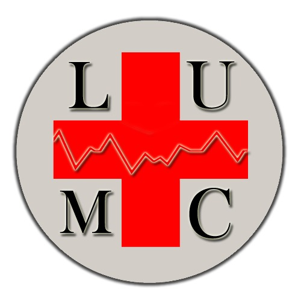

# Clinic-Mobile-Application



## 🚀 Overview

In this project, a clinic android application has been implemented and designed in which a user can register as a patient and consult the doctor he wants, or as a doctor in which he can follow the health states of his patients and add medical records, examinations and medicines. As an authenticated user, he/she can see the history/evolution of a specific data in the treatment and be able to insert the results of medical examinations.


## 🎯 Features

The features of this application include its ability to register different kinds of users in the clinic and give each user his/her access rights as stated in the summary of this project to stimulate a real life clinic.    


## 🔧 Installation

To get started with **Clinic-Monile-Application**, follow these simple steps:

1. **Clone the repository:**
   ```bash
   git clone https://github.com/rtaleb/Clinic-Mobile-Application.git
2. **Open in Android Studio:**
   - Launch Android Studio.
   - Select Open an existing project.
   - Navigate to the cloned repository and select it.
3. **Build the Project:**
   - Click on Build in the top menu.
   - Select Build APK(s).
4. **Run the Application:**
   - Connect your Android device or start an emulator.
   - Click on the Run button in Android Studio or use the shortcut Shift + F10.


## 🚀 Usage

Here's how you can start using Clinic-Mobile-Application:
1. Launch the app on your Android device.
2. Explore the features.

   
## 📚 Documentation

For detailed information on how to use Clinic-Mobile-Application, please refer to our Documentation.

## 📜 License

This project is licensed under the MIT License - see the LICENSE.md file for details.


