## 📖 Overview

In this report, a clinic android application has been implemented and designed. The work is organized using agile scrum method to get the best business value. All the tasks in the product backlog are done. This application is phone-based and can be run on your mobile. We hope everybody will take benefit from our application. 

This directory contains detailed documentation for **Clinic-Mobile-Application** project, including diagrams (ER diagram, UML diagram, Use case diagram and Sequence diagram), the details of using Agile method, the the design patterns used and other technical explanations.

## Agile Scrum
The project makes progress in a series of  "sprints" (1 - 4 week each) where each sprint is preceded by a sprint planning meeting to select from the Product backlog what can be committed at the end of sprint, define sprint goal and sprint backlog. Project is designed, coded and tested during the sprint. Daily srum meeting is done every 24 Hours. After each sprint, we make a sprint review to present what accomplished during the sprint and a sprint retrospective to take a look at what is and is not working . 
**The work runs in 3 sprints:**

**First Sprint:**
   - Implement a list of all available doctors in the clinic ordered by name and specialty and allow each user to see it and search for a doctor by first and last name.
     
     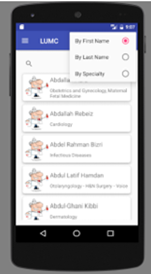

   - Implement a list of patients for each doctor and allow each doctor to view his list of patients and can search for a patient by first and last name.

     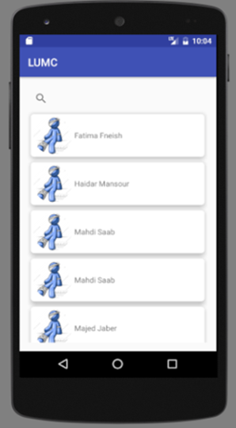

   - Implement code and xml for doctor profile and patient profile.

     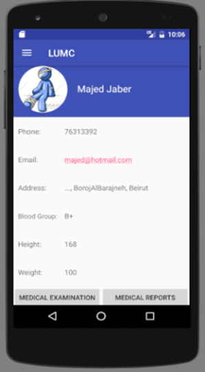  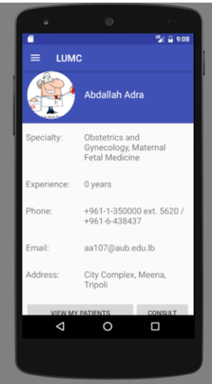

     
**Second Sprint:**
   - Implement the code and the xml page for medical examinations and allow the user to insert results of medical examinations.

     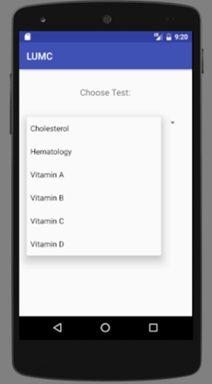 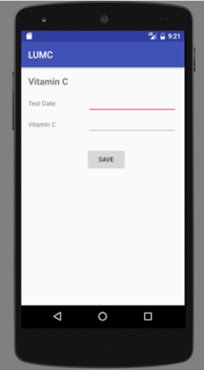
     
   - Implement the code and the xml that allows patients and doctors to view the history of a specific data during the treatment.
     
   - Implement the code that allow each doctor to order treatment and precautions for his patients.

     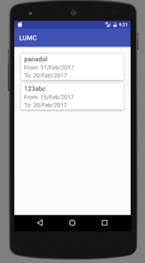 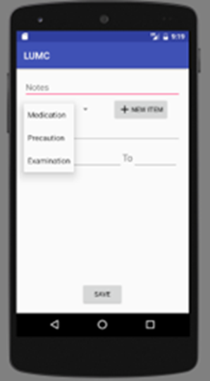
     
**Third Sprint:**
   - Implement the code and xml that allows a patient to consult the results of his medical examinations.
     
   - Implement the code and xml that allows each doctor to order medical examinations for his patients.

     
     
   - Implement the code and xml for medical records for each patient and allow the doctor to see them.

     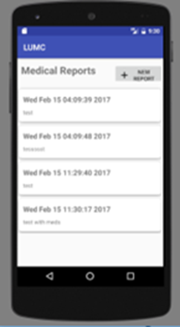
     
   - Implement the code and xml that allows the  user to register in the application as a patient or doctor and login.

     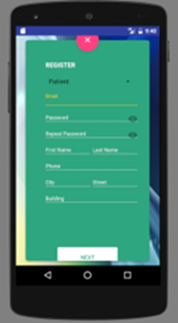 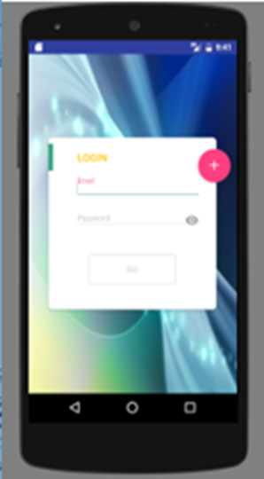

## Database
We used **Power designer** to draw the ER-diagram, **star-UML** to draw the class diagram, **GenMyModel** to draw the usecase diagram and **NoSQL** in the FireBase DataBase for code implementation.

### Entity Relation ER Diagram
12 tables exist in the ER diagram : patient, doctor, certificates, consults, medicalReport, medication, precaution, examination, healthState, prescExam, doctorConsults and patientConsults.

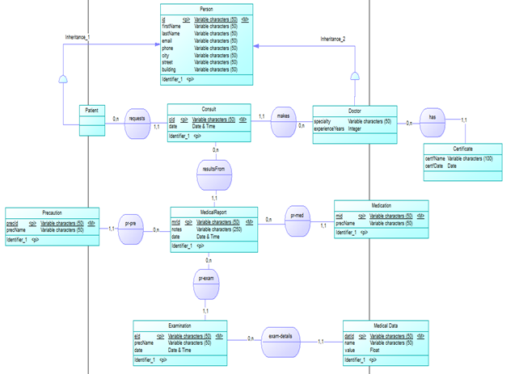

### Class Diagram
**StarUML** is used to draw the class diagram and **Android Studio** for implementation. The class diagram is formed of 18 classes.
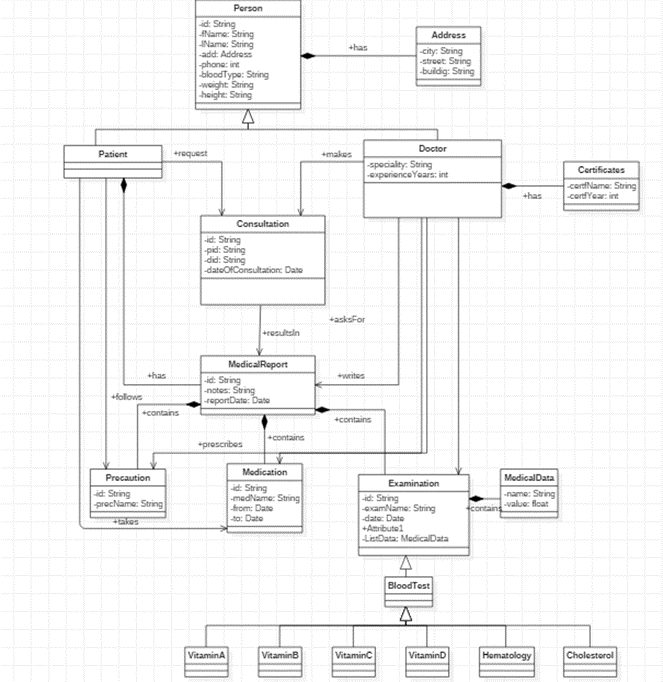

### Use case Diagram
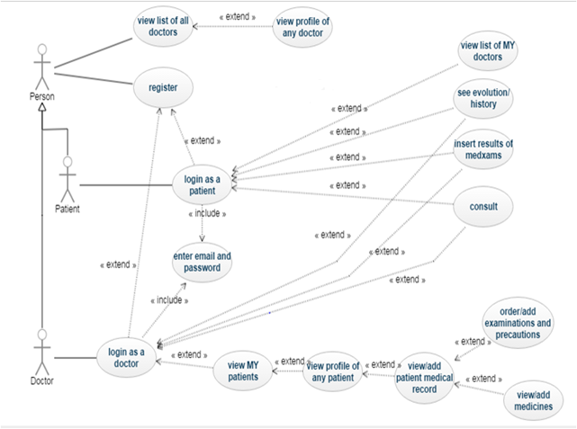

## 📑 Implementation

	We use the object oriented programming as well as Firebase queries in the implementation. 
 
### Constraints
	
 Constraints on user permissions are implemented based on the user type, whether the user is a doctor, patient, or guest:
   - Registration as a doctor requires providing the correct doctorKey from the clinic.
   - Non-authenticated users cannot consult any doctor in the clinic.
   - Doctors can only see the list of their own patients.
   - Authenticated users can edit only their own profiles.
   - Only doctors can comment on the health states of their patients and add medical reports, examinations, medications, and precautions for their patients.

### Security
	
 The Firebase Realtime Database offers a comprehensive suite of tools for managing the security of the application. These tools facilitate user authentication, enforce user permissions (such as admin, doctor, patient, guest, etc.), and validate inputs. The FirebaseAuth class from the Firebase Authentication SDK serves as the entry point for these authentication features. Email and password-based authentication is implemented, and the Firebase Authentication SDK provides methods to create and manage users who sign in using their email addresses and passwords.

 

